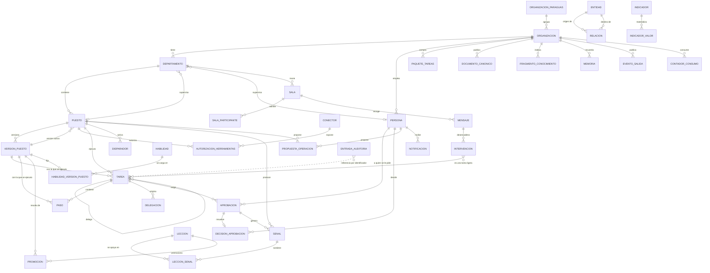

VIGENTE

# Modelo de datos v1 · diagrama de entidades

Anexo del [ADR-007](../adr/ADR-007.md) y de la [especificación de la rebanada](../specs/modelo-de-datos-v1.md).
El esquema tipado vive en `packages/db/src` y en `packages/ledger/src/db`; la
migración que lo crea, en `packages/db/drizzle/0000_inicial.sql`. Son 37 tablas de
entidad, más `migracion_aplicada` y las particiones mensuales.

Cualquier cambio posterior del modelo es una migración con su propia rebanada y la
revisión de Jesús: este documento se actualiza en la misma rebanada que el cambio.

## Relaciones clave

La entrada de auditoría aparece con línea discontinua a propósito: referencia a
cualquier entidad por identificador y nunca con clave foránea, para sobrevivir a
purgas y archivados.

## Entidades

| Entidad                                   | Tabla                                                  | Qué guarda                                                                 | Regla que importa                                                        |
| ----------------------------------------- | ------------------------------------------------------ | -------------------------------------------------------------------------- | ------------------------------------------------------------------------ |
| Organización paraguas                     | `organizacion_paraguas`                                | Partner con organizaciones cliente, permisos cruzados y facturación        | Solo se lee, y solo el paraguas del tenant de la sesión                  |
| Organización                              | `organizacion`                                         | Plan, región de datos, límites, retención, política de cruce y brand voice | Es la raíz del tenant: su `id` es el `tenant_id` de todo lo demás        |
| Persona                                   | `persona`                                              | Quien aprueba, supervisa y recibe notificaciones                           | La identidad completa llega con Better Auth en su rebanada               |
| Paquete de tareas                         | `paquete_tareas`                                       | Tareas prepagadas, caducidad y consumo                                     | Se consume tras el cupo del plan, sin sobrecoste automático              |
| Departamento                              | `departamento`                                         | Brand voice de rama, supervisores, presupuesto, memoria compartida         | Hereda la brand voice general y la sobrescribe por campos, con versión   |
| Puesto                                    | `puesto`                                               | Ficha, clase de riesgo, enrutado de modelo, expediente y versión activa    | El puntero a la versión activa se cambia en un clic                      |
| Versión de puesto                         | `version_puesto`                                       | Prompt, política, habilidades y memoria congelados                         | Fila inmutable: es la unidad de reversión y de auditoría del aprendizaje |
| Habilidad                                 | `habilidad`                                            | Procedimiento versionado con pasos, comprobaciones y casos                 | Pasa evals antes de activarse                                            |
| Tarea                                     | `tarea`                                                | Origen, puesto, estado, coste, resultado y jerarquía                       | El estado es una proyección de Temporal, reconstruible                   |
| Paso                                      | `paso`                                                 | Tipo, herramienta, entrada, salida, coste y duración                       | Referencia la versión de puesto con la que se ejecutó                    |
| Delegación                                | `delegacion`                                           | Encargo, plazo, presupuesto y formato                                      | Flujo hijo; marca si cruza departamento                                  |
| Aprobación                                | `aprobacion`                                           | Borrador opaco, resumen legible, clase de acción, nivel exigido y plazo    | Fila inmutable; resolverla no la actualiza                               |
| Decisión de aprobación                    | `decision_aprobacion`                                  | Sentido, motivo, quién decidió y qué había antes de editarlo               | Una fila por aprobación; «pendiente» es no tener fila aquí               |
| Disparador                                | `disparador`                                           | Tipo, puesto, propietario, nivel y presupuesto                             | Activarlo o pausarlo es una operación de organización                    |
| Señal                                     | `senal`                                                | Origen, tipo, contenido y evaluación                                       | Particionada por mes; se referencia por identificador                    |
| Lección                                   | `leccion`                                              | Contenido y parámetros acotados                                            | Fila inmutable, trazable hasta sus señales                               |
| Promoción                                 | `promocion`                                            | Lección, versión resultante, evidencia y evals                             | Fila inmutable; permite revertir                                         |
| Sala, participante, mensaje, intervención | `sala`, `sala_participante`, `mensaje`, `intervencion` | Ámbito, participantes, hilos y acuerdos                                    | `mensaje` particionado por mes; cada intervención es una tarea ligera    |
| Propuesta de operación                    | `propuesta_operacion`                                  | Cambio propuesto, efectos, coste, evidencia, decisión y reversión          | Única vía para cambiar la organización; queda aunque se rechace          |
| Conector                                  | `conector`                                             | Tipo, herramientas descubiertas y credenciales cifradas                    | Las credenciales nunca entran en el contexto del modelo                  |
| Autorización de herramientas              | `autorizacion_herramientas`                            | Lista blanca y nivel por clase de acción                                   | Relación N:M entre puesto y conector, con sus atributos                  |
| Documento canónico                        | `documento_canonico`                                   | Manual versionado con propietario y ámbito                                 | Prevalece sobre cualquier fragmento indexado                             |
| Fragmento de conocimiento                 | `fragmento_conocimiento`                               | Texto, embedding, fuente, ámbito, acceso y frescura                        | Se borra al borrarse el origen; nunca lleva categorías especiales        |
| Memoria                                   | `memoria`                                              | Contenido y embedding con ámbito, caducidad y marca especial               | Los tres ámbitos: organización, departamento y puesto                    |
| Entidad y relación                        | `entidad`, `relacion`                                  | Grafo ligero con identificadores por sistema                               | Se reconstruye desde los conectores                                      |
| Indicador y valor                         | `indicador`, `indicador_valor`                         | Definición, fórmula, fuentes, umbrales y serie materializada               | Exportable con su definición                                             |
| Notificación                              | `notificacion`                                         | Destinatario, canal, motivo, entidad, plazo y suplente                     | Agrupable en lote; escala si vence el plazo                              |
| Salida de eventos                         | `evento_salida`                                        | Tipo, destino y carga                                                      | Se escribe en la misma transacción que el cambio                         |
| Entrada de auditoría                      | `entrada_auditoria`                                    | Quién, qué, con qué, coste, duración, versión y hash encadenado            | Append-only, particionada por mes, sin `UPDATE` ni `DELETE`              |
| Contador de consumo                       | `contador_consumo`                                     | Tareas, pasos, acciones y coste por periodo                                | Toda acción del libro suma aquí, en la misma transacción                 |

## Índices que importan

- Todos los de tenant empiezan por `tenant_id`: sin eso, la seguridad de fila filtra
  después de leer y las consultas del panel se van de tiempo.
- `entrada_auditoria`: `(tenant_id, numero_orden desc)` para encadenar, y
  `(tenant_id, creado_en desc)`, `(tenant_id, puesto_id, creado_en desc)` y
  `(tenant_id, tarea_id, creado_en desc)` para el panel.
- `mensaje`: `(tenant_id, sala_id, creado_en)` y `(tenant_id, hilo_id, creado_en)`.
- `memoria` y `fragmento_conocimiento`: HNSW sobre el vector, más
  `(tenant_id, ambito, ambito_id)` para acotar antes de buscar.
- `entidad`: índice GIN sobre `identificadores`, que es donde vive el mapeo con cada sistema.
- `decision_aprobacion`: única sobre `(tenant_id, aprobacion_id)`. Además de impedir
  dos decisiones para la misma aprobación, es la que resuelve con un `Index Only Scan`
  el anti-join de «aprobaciones sin decisión» del panel.

## Medidas

El informe de carga con un millón de entradas de auditoría y cien mil mensajes está
en [`packages/db/bench/informe.md`](../../packages/db/bench/informe.md).
